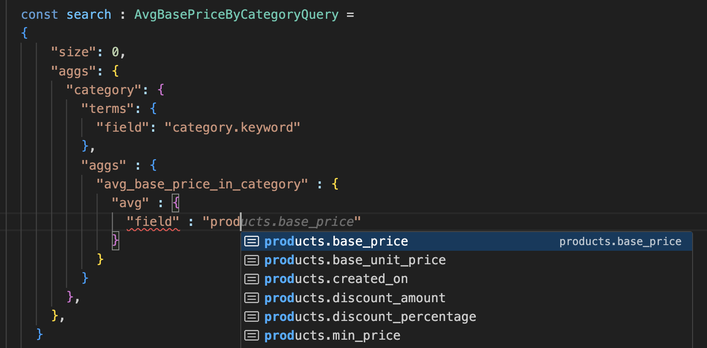
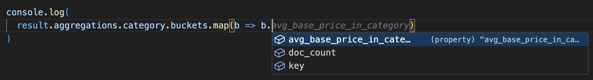
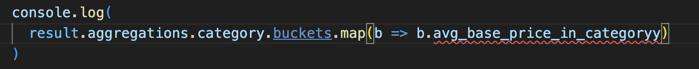

# Opensearch-Typescript

This library can be used to proxy the opensearch client which then provides a more type-rich client. For the most part this is a seemless change, the same requests which worked with `@opensearch-project/opensearch` will work with `opensearch-typescript`, with the exception of **Multi-search** (see workaround below). I wrote this library after experiencing too much difficulty when trying to write opensearch querries in code, I would always have ot write them in the **Dev Tools** console, and then turn them into code, which wasn't too dificult. But what provided me enough motiviation to create this library was then parsing the respones in code was overly complex without a type-system for the respones.

## Usage
To use this library, create the `TypescriptOSProxyClient` client by wrapping the `opensearch Client`:
```typescript
new TypescriptOSProxyClient(client)
```

To have strongly typed query and responses, the requirement is to define a `Search<T,A extends AggsQuery>` whereby `T` represents the type of your document in the index, and `A` is a description of the aggregation query you are planning to perform, which contains the nested aggregation structure, as well as the type of aggregation looking to be performed. With `T` & `A` this provides typescript with enough information to calculate the type of the response from opensearch. For example lets look at the sample ecommerce data and do a query to find the average baes price in a category. I used [quicktype](https://quicktype.io/) to generate the type `Ecommerce` which can be found [here](docs/files/Ecommerce.ts).

```typescript
  type AvgBasePriceByCategoryQuery = Search<Ecommerce, {
    category : {
      agg : "terms",
      aggs : {
        "avg_base_price_in_category" : {
          agg : "avg",
        }
      }
    }
  }>
```

Now when we write this query we get autocomplete suggestions, and highlighting for incorrect type errors:


Then to do the search:

```typescript
const search : AvgBasePriceByCategoryQuery = 
{
    "size": 0,
    "aggs": {
    "category": {
        "terms": {
        "field": "category.keyword"
        },
        "aggs" : {
        "avg_base_price_in_category" : {
            "avg" : {
            "field" : "products.base_price"
            }
        }
        }
    }
    }
}

const result = await tsClient.searchTS({
    body : search,
    index : "opensearch_dashboards_sample_data_ecommerce"
})
```
Whilst you will have to specify the `type` of the `search` object, as it's not possible to infer types for this case, however the `result` object you'll notice is strongly typed, having a type of:
``` typescript
const result: SearchResponse<Ecommerce, {
    category: {
        agg: "terms";
        aggs: {
            "avg_base_price_in_category": {
                agg: "avg";
            };
        };
    };
}>
```
This provides proper auto-complete suggestions and compile checks:

**Autocomplete**


**Compiler Checks**


Drastically reducing programmer errors, and making it just as easy if not easier to write queries within a typescript project.


## Incomplete Client Coverage
Please note this client is not 100% complete, please reach out if parts of the opensearch client are missing and you want to make use of this library, I will do my best to keep this as up-to-date as possible. I also haven't tested all `agg` queries, with all permutations of `number|string` and `dates`.

## Incomplete Types
I have support thus for for:
 - `string`
 - `number`
 - `Date`
 - `boolean`
 - `GeoPoint`

I plan to have strong types for other fields in the future, for not strings can be used.

## Multi-search Limitation
I was not able to map individual values in a dictionary to different types. This meant I couldn't map a collection of requests to a strongly typed collection of responses. The work-around for this was to store the responses of each individual request back onto itself. Because the type information of the request remained in-tact after execution, this was the only way to all the type information in type-script. Obviously this has some paradigm drawbacks, mutating requests as opposed to immutability and functional paradigms It also requires different code if you were to refactor existing opensearh code to make use of this library.


## Elasticsearch
This same approach could be taken with Elasticsearch but unless adoption of this client takes off I don't plan to replicate this in Elasticsearch.
